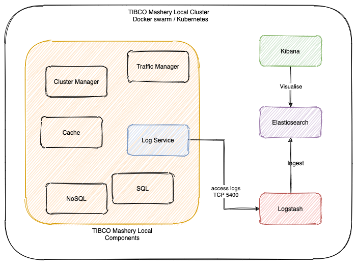
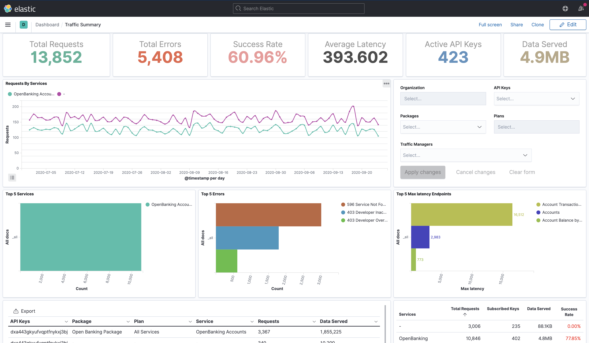
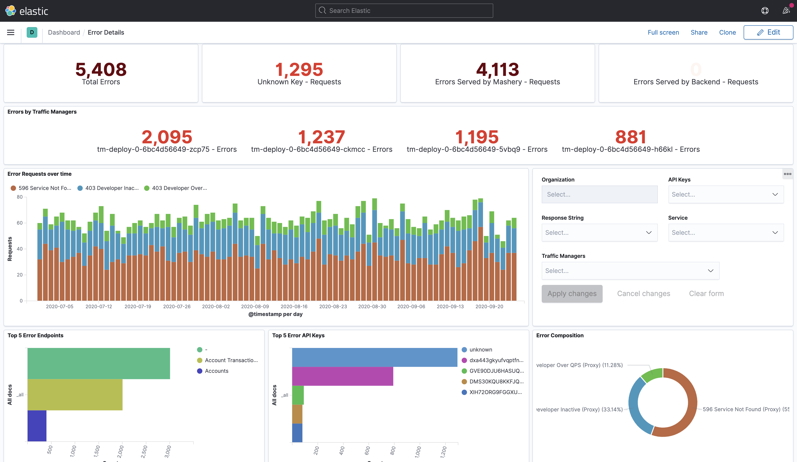
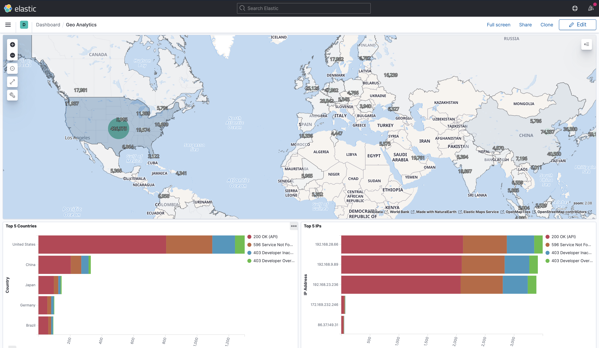
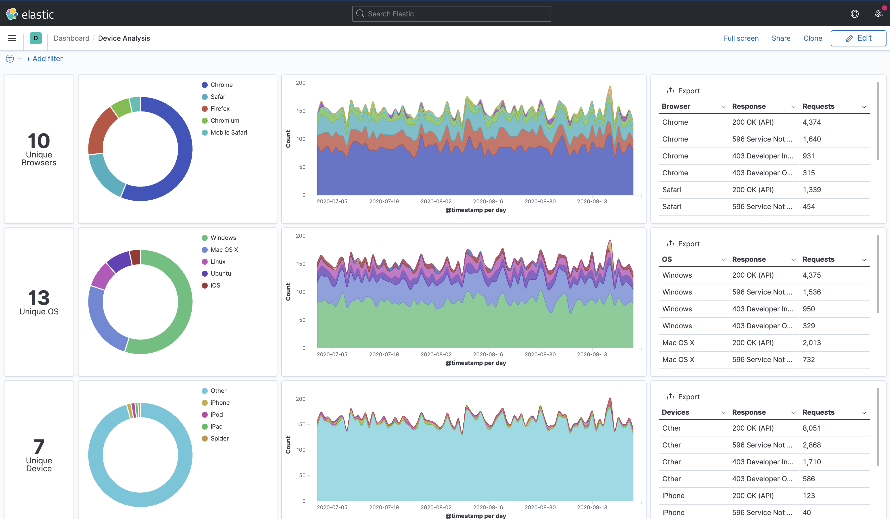

# API Analytics with Elastic Stack
**[Elastic Stack](https://www.elastic.co/elastic-stack)** is well known for its powerful data indexing, searching and analytics capabilities. The samples provided in this folder will help to quickly set up the elastic stack along with sample dashboards on Kubernetes and Docker Swarm.   

These samples were designed for TIBCO Mashery® Local, though it would be possible to the TIBCO Cloud Mashery ECLS along with Logstash websocket receiver to analyse the TIBCO Cloud Mashery API traffic.

Tested with TIBCO Mashery® Local 5.3.1 and should be compatible with newer versions.

## Table of Contents
1. [High-Level Design](#high-level-design)
2. [Dashboards Overview](#dashboards-overview)  
    1. [Traffic Summary](#traffic-summary)
    2. [Error Details](#error-details)
    3. [Geo Analytics](#geo-analytics)
    4. [Device Analytics](#device-analytics)
3. [Getting Started](#getting-started)
4. [Configuring TML Log Service](#configuring-tml-log-service)
5. [Deploying to other topologies](#deploying-to-other-topologies)

## High-Level Design
The setup consists of Logstash, Elasticsearch & Kibana containers deployed in the same cluster as TIBCO Mashery Local. The [Log Service](https://docs.tibco.com/pub/mash-local/5.4.0/doc/html/GUID-F09C3124-7ECC-4356-8CC5-7C4CE7DB69AE.html) is configured to forward logs to the Logstash TCP receiver.
Logstash enriches the incoming traffic logs and ingests it into Elasticsearch. Kibana is then used to visualize the logs and dashboards. 

The ingested logs contains `timestamp` - when the request was processed by Traffic Manager, and `ingestion_timestamp` - when the data was received by Logstash to ingest. These fields can help identify any delays in log ingestion.  

## Dashboards Overview
Take a quick look at dashboards provided in the samples. If you have any suggestions or ideas to improve or enhance these please raise a GitHub issue for review.

### **Traffic Summary**
Provides an overview of the traffic data.

<!-- -->
  

### **Error Details**
Helps to drill down into errors and find a non-performing API / fault Traffic Manager or a suspicious client.

<!---->
  

### **Geo Analytics**
See which countries are most responsible for driving your platform adoption. 

<!---->
  

### **Device Analytics**
Analyze your traffic by devices, operating systems & browsers. 

<!--[Device Analytics](./assets/device-analysis.png)-->
  

## Getting Started
The quick start scripts are provided in k8s and swarm folder. The scripts deploy a single instance of Elasticsearch, Kibana and Logstash. The scripts are provided for Open Source Elastic stack as well as for version 7.12.0 - which is under Elastic License.  
To run the quick start -
1. Clone the git repository on your kubernetes / docker swarm master node
2. Navigate to `api-analytics/elastic_stack/k8s or swarm`
3. Execute - `./setup.sh` or `./setup-oss.sh`
4. To teardown the cluster, execute - `./teardown.sh`

Check the logs of logstash, elasticsearch and kibana containers to ensure that they have started successfully.

## Configuring TML Log Service
TIBCO Mashery Local provides an access log exporting feature to various output destination. In this setup, the log service is configured to forward access logs to Logstash on TCP port 5400.

To configure the log service, use the provided [json](./configs/mashery_logforward.json) and follow these steps:  
1. Copy mashery_logforward.json to cm container  
`docker or (kubectl) cp ./configs/mashery_logforward.json cm-container-id:/home/builder`
2. Exec into the cm container   
`docker or (kubectl) exec -it cm-container-id /bin/bash`
3. Get the log service component Id. Once inside the container, execute -  
`cm list components`  
Copy the log service component Id.
4. Configure log service  
`cm import config --componentType logservice --componentId <componentId> --file mashery_logforward.json`

The detailed steps to import and validate config change are provided in the TIBCO Mashery Local [documentation](https://docs.tibco.com/pub/mash-local/5.4.0/doc/html/GUID-C01F77C2-CDF8-46E1-BBB5-0BE850F283A7.html).

## Deploying to other topologies
Scripts to deploy in Kubernetes and Docker swarm environment are provided in the samples. This section describes how the templates can be used to work with any other deployment topology.  

### Logstash
Logstash includes a pipeline [configuration file](./configs/logstash/logstash.conf) as well as an [index template](./configs/logstash/index_template.json) for Elasticsearch.     
Index template is used for mapping lat/long information as geo-point and converting src_ip to IP datatype. This file is referred in `logstash.conf` in the output section.    
Ensure that index templates relative path is updated in `logstash.conf` file and Logstash instance is started using this configuration file.   
**Note**: The index name in `logstash.conf` should be of format - `tml_access_logs*` for the dashboards to work.

### Kibana
Kibana dashboards are provided as saved objects in `/configs/kibana` folder. To import these dashboards on Kibana, go to -      
`Stack Management -> Saved Objects -> Import` and import the appropriate file.  
Once Logstash starts ingesting logs into Elasticsearch, the Kibana dashboards should start showing the same.
