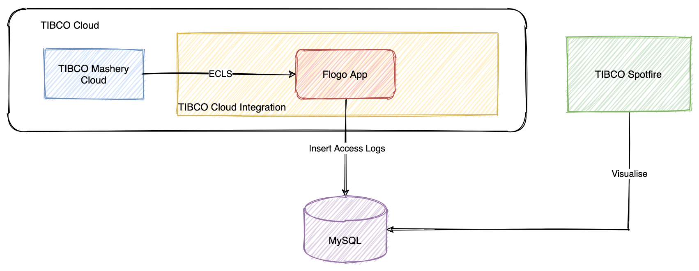

# API Analytics with TIBCO Spotfire®

The TIBCO Spotfire® Analytics file provided in the folder includes sample dashboards to quickly and easily start analyzing your API traffic. This analytics file can be configured to work with both TIBCO Mashery® Local and TIBCO Cloud™ Mashery®.

For more information on the provided dashboards, visit [TIBCO Mashery Local - API Analytics | TIBCO Community](https://community.tibco.com/wiki/tibco-mashery-local-api-analytics)

Tested with TIBCO Mashery Local 5.3.1 and should be compatible with newer versions.

Built on - TIBCO Spotfire® Desktop 11.1.0

## Table of Contents
1. [Database Setup](#database-setup)
    1. [TIBCO Mashery Local](#tibco-mashery-local)
    2. [TIBCO Cloud Mashery](#tibco-cloud-mashery)
2. [Configure TIBCO Spotfire](#configure-tibco-spotfire)  

**DISCLAIMER**: The Spotfire Analytics DXP dashboard is provided as a template and is not supported by TIBCO Support.

## Database Setup
This section describes how to setup your database for access logs and configure the product to populate data.  
Data Definition Language (DDL) scripts are provided for Postgres and MySQL.

### **TIBCO Mashery Local**
TIBCO Mashery Local provides a [Database Recipe](https://docs.tibco.com/pub/mash-local/5.4.0/doc/html/GUID-4036FB07-6A96-4536-BF21-73B26CF7778C.html) to export access logs into a SQL database. Currently supported databases are Postgres 9.2+ and MySQL 5.5+.  

### **TIBCO Cloud Mashery**
For TIBCO Cloud Mashery, Enriched Call Log Streams along with a TIBCO Flogo® application can be used to capture access logs and insert them into a database.   
You will need a subscription to both TIBCO Cloud™ Mashery and TIBCO Cloud™ Integration for this setup. 

To configure ECLS, log in to Mashery® Control Center and navigate to -  
`Analyze -> Call Log Stream -> Create Channel and a Access token `  
Copy and save the websocket url.

Switch to TIBCO Cloud Integration for setting up a Flogo® application:  
A sample Flogo application - ***ecls_flogo_app.json*** is provided in this folder. This application uses [ECLS Trigger](https://github.com/mmussett/flogo-components/tree/master/trigger/ecls).   
Before importing the Flogo application -  
1. Install the ECLS Trigger
2. Create MySQL connection

After importing the application, update the ECLS URL and database connection.

**Note**: If you are hosting the database on cloud platform, check out the TIBCO Cloud™ Integration [IP Whitelisting](https://integration.cloud.tibco.com/docs/tci/getstarted/reference/whitelisting.html) requirements.

## Configure TIBCO Spotfire
The analytics file is embedded with sample data so you can get a quick look & feel of the dashboards. To start analyzing your data, replace the embedded data with your database. Follow this [Replacing a data source](https://docs.tibco.com/pub/spotfire_server/7.11.0/doc/html/en-US/TIB_sfire-bauthor-consumer_usersguide/GUID-12C512A3-0301-4E1C-A07C-55F50A6FFE25.html) guide.
