## TIBCO Cloud™ API Management - Observability with Elasticsearch
This repository contains the necessary artifacts to enable observability for the API Management - Local Edition components using Elasticsearch.

## Table of Contents
- [Prerequisites](#prerequisites)
- [Artefacts](#artefacts)
- [Configuration](#configuration)
  - [application_conf](#application_conf)
    - [input.properties](#inputproperties)
    - [stack.properties](#stackproperties)
  - [observability_conf](#observability_conf)
  - [scripts](#scripts)
- [Usage](#usage)
- [Visualizations Overview](#visualizations-overview)

### Prerequisites
- ElasticSearch and Kibana are installed and running
- A user(admin preferred) with basic authentication is created and has access to the ElasticSearch cluster.
- A user(admin preferred) with basic authentication is created and has access to the Kibana.

Note: If you don't have an Elasticsearch cluster setup yet, please refer to our capacity estimation [guide](../CAPACITY_GUIDE.md) which will help you in creating the right sized cluster for your load.

### Artefacts
This repository contains the following artefacts:
- application_conf
  - This directory contains the configuration details about your Elasticsearch cluster.
  - It contains 2 files:
    - input.properties
    - stack.properties
- observability_conf
  - This directory contains the configuration files related to the components that we want to create in Elasticsearch.
- scripts
  - This directory contains the bash script to create the components in Elasticsearch.

### Configuration
#### application_conf ####
##### input.properties #####
  - This file contains the details about the Elasticsearch cluster.
  - You need to update the following properties:

**basic properties**

| Property               | Description                   | Example      |
|:-----------------------|:------------------------------|:-------------|
| elasticsearch_host     | Elasticsearch host            | localhost    |
| elasticsearch_port     | Elasticsearch port            | 9200         |
| elasticsearch_protocol | http or https                 | https        |
| elasticsearch_username | Elasticsearch valid username  | apim         |
| elasticsearch_password | Elasticsearch password        | password@123 |
| kibana_host            | Kibana host                   | localhost    |
| kibana_port            | Kibana port                   | 5601         |
| kibana_protocol        | http or https                 | http         |
| kibana_username        | Kibana valid username         | kibana       |
| kibana_password        | Kibana password               | password@123 |


 **advance properties**

| Property                                                         | Description                                                                                                                                                                                                                                                                                                                                                                                                                                                   | Example |
|------------------------------------------------------------------|---------------------------------------------------------------------------------------------------------------------------------------------------------------------------------------------------------------------------------------------------------------------------------------------------------------------------------------------------------------------------------------------------------------------------------------------------------------|---------|
| component_templates_apim_main_settings_number_of_shards          | Property to configure # of shards for apim_main index. Because you can't easily change the number of primary shards for an existing index, you should decide about the shard count before indexing your first document. Number of shards and rollover configuration work hand in hand. <br>See the [section](#guidelines-to-determine-right--of-shards-and-rollover-configuration) to determine the right shards configuration for your use case.             | 12      |
| component_templates_apim_main_settings_number_of_replicas        | Property to configure # of replicas for apim_main index.                                                                                                                                                                                                                                                                                                                                                                                                      | 1       |
| component_templates_apim_application_settings_number_of_shards   | Property to configure # of shards for apim_application_logs index. Because you can't easily change the number of primary shards for an existing index, you should decide about the shard count before indexing your first document. Number of shards and rollover configuration work hand in hand. <br>See the [section](#guidelines-to-determine-right--of-shards-and-rollover-configuration) to determine the right shards configuration for your use case. | 6       |
| component_templates_apim_application_settings_number_of_replicas | Property to configure # of replicas for apim_application_logs index.                                                                                                                                                                                                                                                                                                                                                                                          | 1       |
| component_templates_apim_debug_settings_number_of_shards         | Property to configure # of shards for apim_debug_logs index. Because you can't easily change the number of primary shards for an existing index, you should decide about the shard count before indexing your first document. Number of shards and rollover configuration work hand in hand. <br>See the [section](#guidelines-to-determine-right--of-shards-and-rollover-configuration) to determine the right shards configuration for your use case.       | 18      |
| component_templates_apim_debug_settings_number_of_replicas       | Property to configure # of replicas for apim_debug_logs index.                                                                                                                                                                                                                                                                                                                                                                                                | 1       |
| apim_main_rollover_policy_rollover                               | timeframe to rollover the apim_main index. See this section to determine the right <br>rollover duration for your use case.                                                                                                                                                                                                                                                                                                                                   | 1d      |
| apim_main_rollover_policy_warm_migration                         | timeframe to migrate the apim_main index from HOT to WARM storage                                                                                                                                                                                                                                                                                                                                                                                             | 30d     |
| apim_main_rollover_policy_cold_migration                         | timeframe to migrate the apim_main index from WARM to Cold storage                                                                                                                                                                                                                                                                                                                                                                                            | 90d     |
| apim_main_rollover_policy_retention                              | timeframe to delete apim_main index index from Cold storage                                                                                                                                                                                                                                                                                                                                                                                                   | 365d    |
| apim_application_rollover_policy_rollover                        | timeframe to rollover the apim_application_logs index. See this section to determine<br> the right rollover duration for your use case.                                                                                                                                                                                                                                                                                                                       | 15d     |
| apim_application_rollover_policy_warm_migration                  | timeframe to migrate the apim_application_logs index from HOT to WARM storage                                                                                                                                                                                                                                                                                                                                                                                 | 30d     |
| apim_application_rollover_policy_cold_migration                  | timeframe to migrate the apim_application_logs index from WARM to Cold storage                                                                                                                                                                                                                                                                                                                                                                                | 90d     |
| apim_application_rollover_policy_retention                       | timeframe to delete apim_application_logs index index from Cold storage                                                                                                                                                                                                                                                                                                                                                                                       | 365d    |
| apim_debug_rollover_policy_rollover                              | timeframe to rollover the apim_debug_logs index. See this section to determine<br> the right rollover duration for your use case.                                                                                                                                                                                                                                                                                                                             | 30m     |
| apim_debug_rollover_policy_retention                             | timeframe to delete apim_debug_logs index index from HOT storage                                                                                                                                                                                                                                                                                                                                                                                              | 1d      |

Note: These policies are defined assuming the customer, will always want to distribute their load in HOT, warm and cold tier. If they don't want to distribute then they need to tweak these policies as per their requirement. 

##### Guidelines to determine right # of shards and rollover configuration

Consider a customer with 500 qps and elasticsearch with 3 data nodes. The goal of choosing the right number of shards is to distribute the load evenly across the data nodes in the cluster. 

There are a few guidelines about sharding that we should consider:
- number of shards should be in the multiple of # of data nodes in the cluster.
- shard size should be between 30-50 GB.

Keeping these guidelines in mind, we can do the below exercise to determine the right # of shards and rollover duration for apim_main index:

| Duration | Required storage                                        |
|----------|:--------------------------------------------------------|
| 1H       | 500 qps * 60 sec * 60 mins * 1 hour * 1.2KB = ~3GB      |
| 1D       | 500 qps * 60 sec * 60 mins * 24 hours * 1.2KB = ~72GB   |                                                   |
| 2D       | 500 qps * 60 sec * 60 mins * 48 hours * 1.2KB = ~144GB  |                                                   |
| 3D       | 500 qps * 60 sec * 60 mins * 72 hours  * 1.2KB = ~216GB |

We have 3 data nodes in the cluster. So, we can choose 3, 6, 9, 12, 15, 18, 21, 24, 27, 30 shards.

As we now know the storage required, let's assume we choose the minimum number of shards i.e 3 shards.

| Duration | Size per shard                |
|----------|:------------------------------|
| 1H       | 3GB/3 = ~1GB per shard        |
| 1D       | 72GB/3 = ~24GB per shard      |
| **2D**   | **144GB/3 = ~48GB per shard** |
| 3D       | 216GB/3 = ~72GB per shard     |

Let's assume we choose twice the number of shards i.e 6 shards.

| Duration | Size per shard                |
|----------|:------------------------------|
| 1H       | 3GB/6 = ~0.5GB per shard      |
| 1D       | 72GB/6 = ~12GB per shard      |
| 2D       | 144GB/6 = ~24GB per shard     |
| **3D**   | **216GB/6 = ~36GB per shard** |

From both the above tables, 2 options (marked in bold) fits in our criteria to keep index size between 30-50GB. 
If you choose 3 shards, then the right rollover interval for your index would be every 2 days (2d). If you choose 6 shards, then the right rollover interval for your index would be every 3 days (3d).

This way one can determine the right number of shards and rollover duration for their use case. 

##### stack.properties #####
  - This properties file contains details about the REST endpoint and http method for each supported component. 
  - Properties in this file should be changed only after consultation with APIM team.

#### observability_conf ####
This directory contains the configuration files related to the components that we want to create in Elasticsearch.
It contains below subdirectories:
- [component_templates](https://www.elastic.co/guide/en/elasticsearch/reference/current/indices-component-template.html)
- [index_templates](https://www.elastic.co/guide/en/elasticsearch/reference/current/index-templates.html)
- [ilm_policies](https://www.elastic.co/guide/en/elasticsearch/reference/current/index-lifecycle-management.html)
- [data_streams](https://www.elastic.co/guide/en/elasticsearch/reference/current/data-streams.html)
- saved_objects
  - [data views](https://www.elastic.co/guide/en/kibana/current/data-views.html)
  - [visualizations](https://www.elastic.co/guide/en/kibana/current/dashboard.html)

#### scripts ####
This directory contains the bash script to create the components in Elasticsearch. This script makes use of the REST API to create the components in Elasticsearch.


### Usage
- Clone the repository
- Update the properties in input.properties and stack.properties
- Run the script to create the components in Elasticsearch

```bash
cd scripts
chmod +x bootstrap.sh
./bootstrap.sh
```

Once the script is executed successfully, you can see the components in Elasticsearch. Login to Kibana and navigate to Discover and you should see below indices:


### Visualizations Overview ###

Take a quick look at the visualizations provided in the samples. If you have any suggestions or ideas to improve or enhance these please raise a GitHub issue for review.

##### Call Distribution by execution time buckets #####
Shows the percentage of calls processed in a given range of execution time. Execution time is the total processing time taken by the traffic manager. It is measured from the time the first byte is received to the very last byte sent in the response. Filters - By uri - Add a filter like uri:/va/offers/faresbestprices/bestfares" - By customer - Add a filter like "customer_name:Google" - By successful calls for a given uri - Add a filter like "uri:/v1/offers AND status<400"
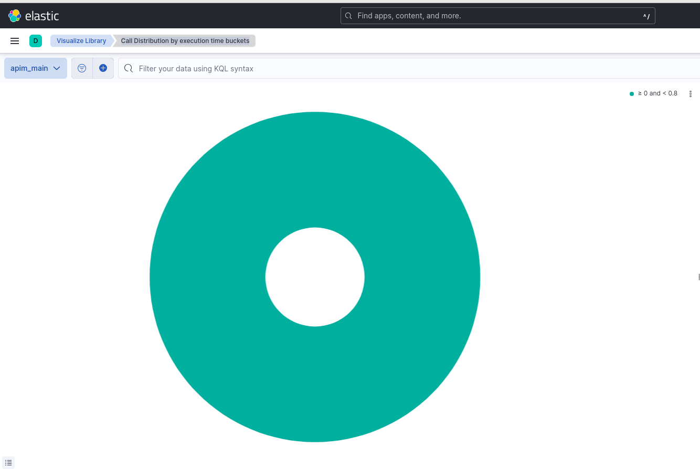

##### Call count aggregated by exec_time in a Time Series #####
Shows a call count aggregated by the exec_time over a period of time. The aggregation is on - exec_time <0.8s - exec_time >=0.8 and exec_time <2 - exec_time>=2 and exec_time<5 - exec_time>=5 - Filters - By customer - Add a filter "customer_name:Google" - By customer and unsuccessful calls - Add a filter "customer_name:Google AND status>399 AND status<600"
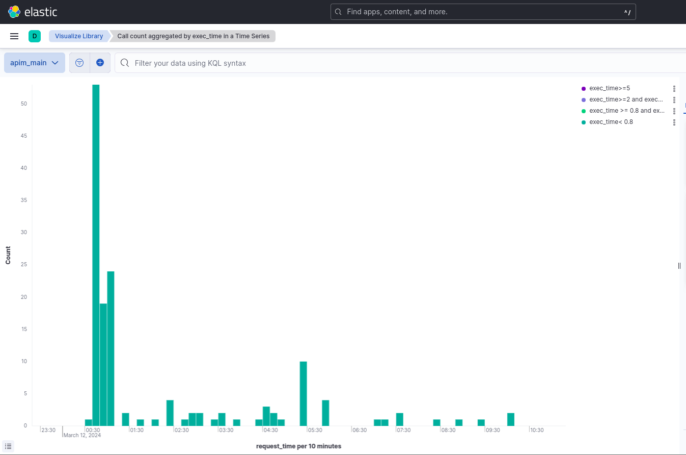

##### Call count aggregated by response string #####
Shows a pie chart aggregating the call count for a given time period. Adding filters - By customer: "customer_name:Google"
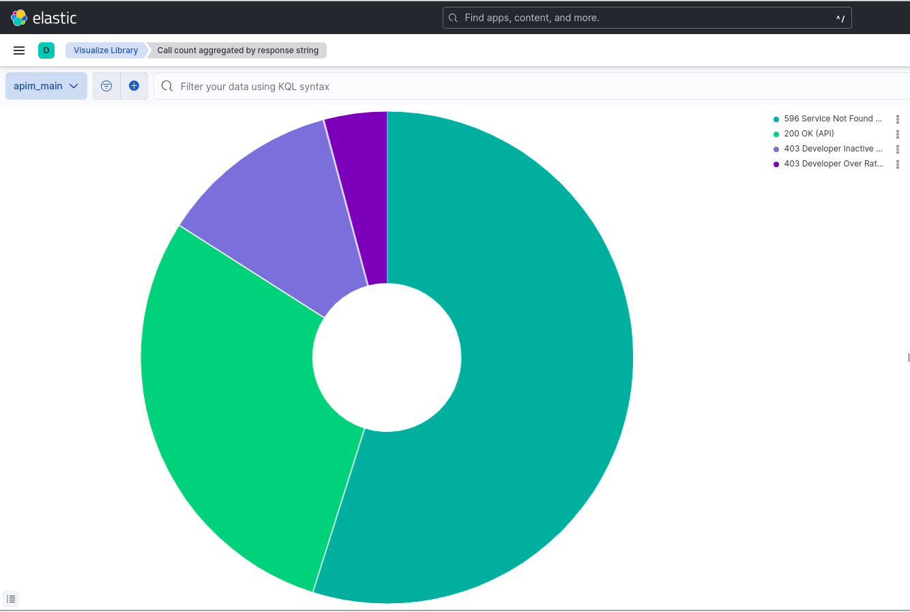

##### Call count aggregated by responsestr in a Time Series #####
Shows call count aggregated by the responsestr over a period of time. Filters - By customer - Add a filter "customer_name:Google" - By customer and unsuccessful calls - Add a filter "customer_name:Google AND status>399 AND status<600"
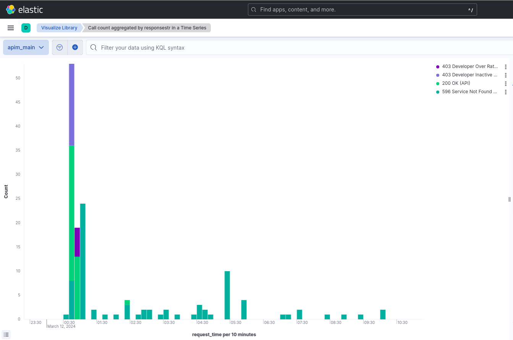

##### Call count aggregated by request_host_name in a time series #####
Shows the call count aggregated by request_host_name over a period of time. Filters - By customer - Add a filter "customer_name:Google" to view all server_name for a given customer - By customer and successful calls - Add a filter "customer_name:Google AND status>=200 AND status<400 - By successful calls - Add a filter "status>=200 AND status<400 - By unsuccessfil calls - Add a filter "status>=400 and status<600
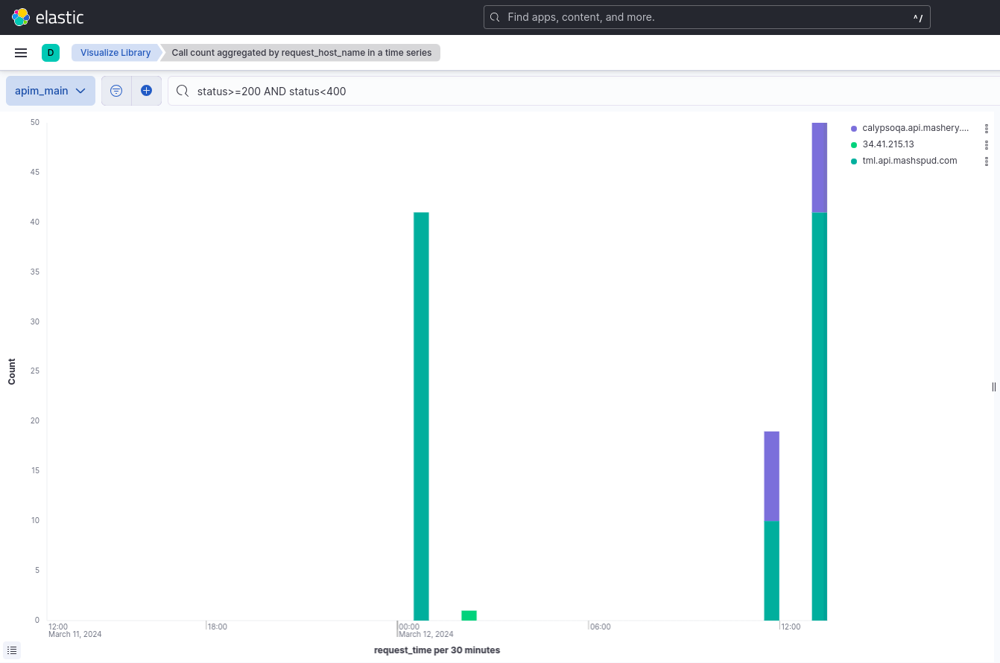

##### Call count aggregated by status in a Time Series #####
Shows call count aggregated by their status over a period of time. Filters - By customer - Add a filter "customer_name:Google" - By customer and unsuccessful calls - Add a filter "customer_name:Google AND status>399 AND status<600"
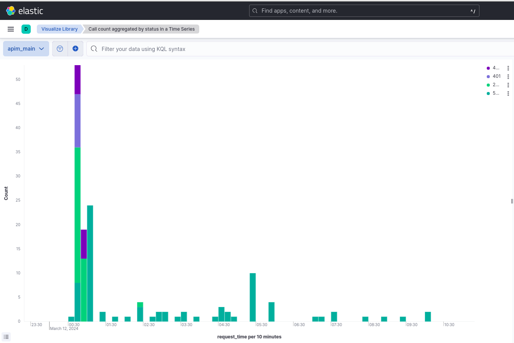

##### Call count aggregated by uri in a time series #####
Shows count aggregated by URI over a period of time. Filters - By customer: To get list of top 10 uri's called by the customer add the filter "customer_name:Google" - By proxy_worker: To get a list of top 10 uri's serviced by a proxy worker, add the filter proxy_worker:<name of the worker>
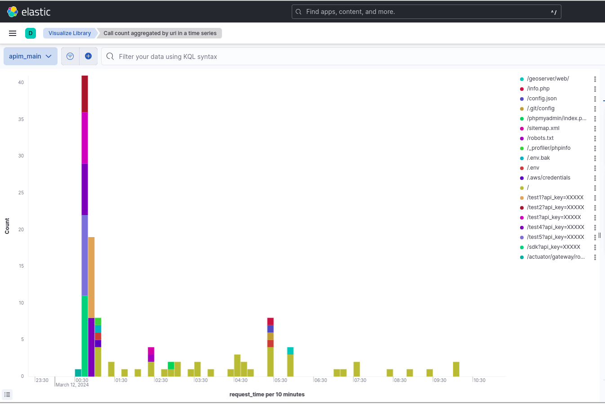

##### Customers: APIM Call Count By Status #####
Shows the call count aggregated by their status over a period of time. Filters - By customer - Add a filter "customer_name:Google" - By customer and unsuccessful calls - Add a filter "customer_name:Google AND status>399 AND status<600"
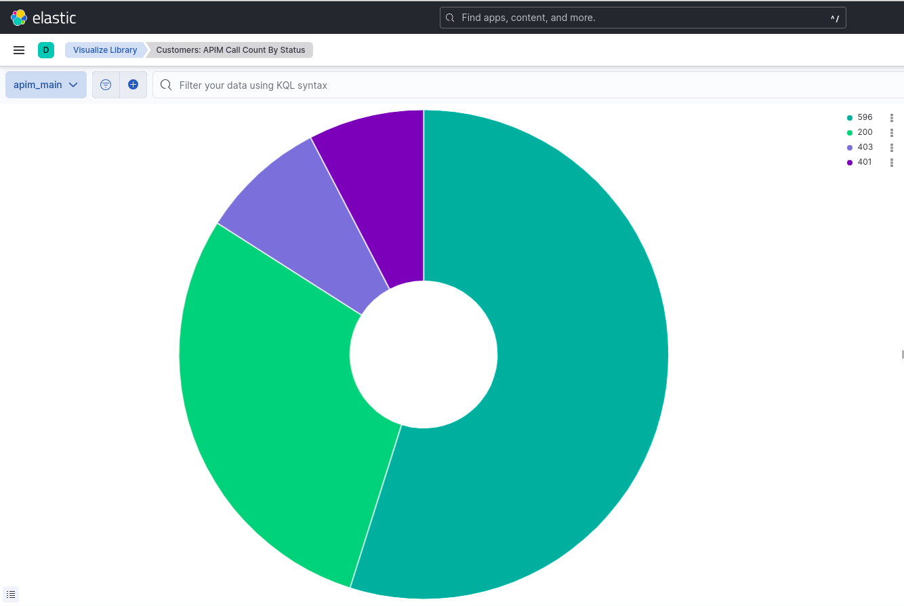

##### Customers: APIM Call Count By Time #####


##### Report: Call Counts aggregated by uri #####
Shows a list of customers with a call count with % share in descending order. By adding filters like - server_name:"api-music.rovicorp.com" - status:200 - status>399 OR status<600 you can get a count aggregated by URI The report can be downloaded as a comma separated values (csv) as well.


##### Report: Mapis with most 403 Developer Overrate #####
Shows report that gives the top 20 mapis resulting in developer overrate. Filters - By customer: Add a filter "customer_name:Google" - By area_id: Add a filter "area_id:260"


##### Report: Show Top 5 Mapi's in use #####
Shows the top 5 Mapis. By adding a filter - By customer - customer_name:Google will show the top 5 mapis in use by a specific customer - By status - Adding the filter status>=400 will show top Mapis returning error
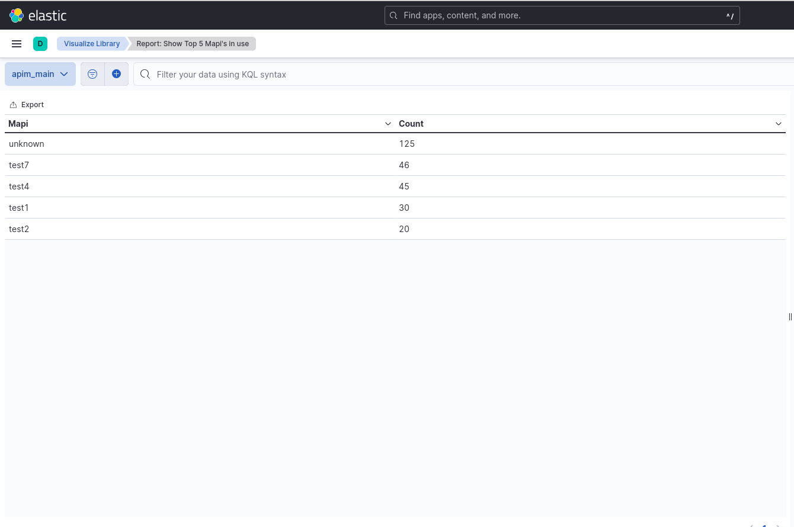

##### Report: Show Top 5 Sp Keys in use #####
Shows the top 5 spkeys in use. Adding a filter - By customer: customer_name:Google will show the top 5 spkeys used by Google - By status: status>=400 will show top 5 spkeys returning error
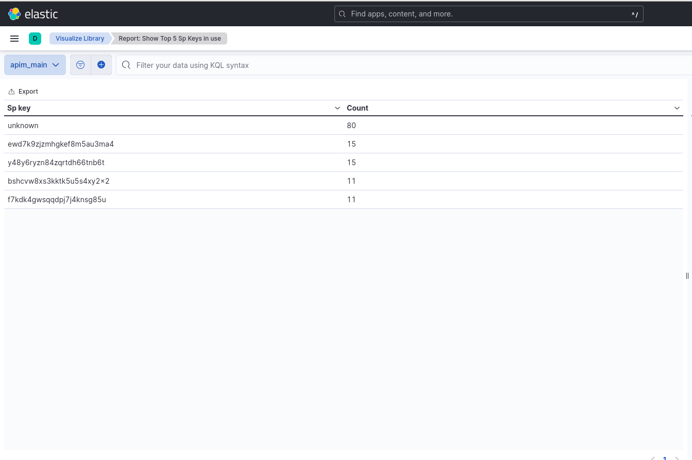

##### Report: Show the slowest URI in descending order #####
Shows the URI that are slowest. By adding a filter - By customer: customer_name:Google will give the slowest URI by a customer - By add a filter like status can narrow down the list of slow URIs
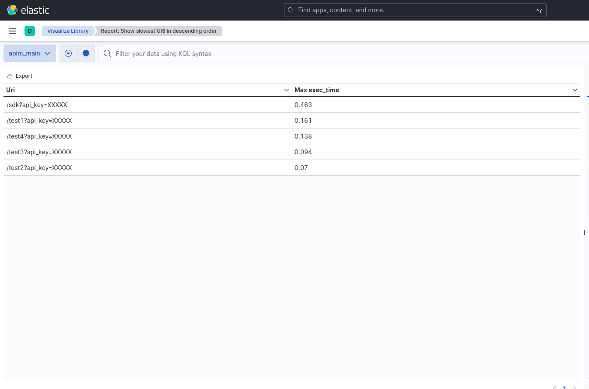
